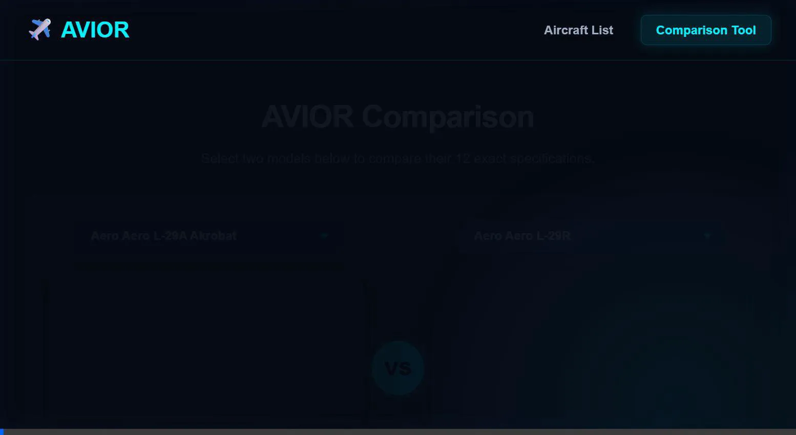

# AVIOR | Aircraft Comparison Tool

<p align="center">
  
</p>

## Run commands

Prerequisite: Node.js (v18+) and npm installed.

Install dependencies:

```
# 1. Enter the inner project folder
cd AVIOR-Aircraft-Comparison-main

# 2. Install dependencies
npm install
```

Start dev server (default: http://localhost:5173/):

```
npm run dev
```

Start dev server on specific port (example 3000):

```
npm run dev -- --port 3000
```

Expose dev server to LAN:

```
npm run dev -- --host
```

Build production bundle:

```
npm run build
```

Preview production build locally:

```
npm run preview
```

Run linter:

```
npm run lint
```


